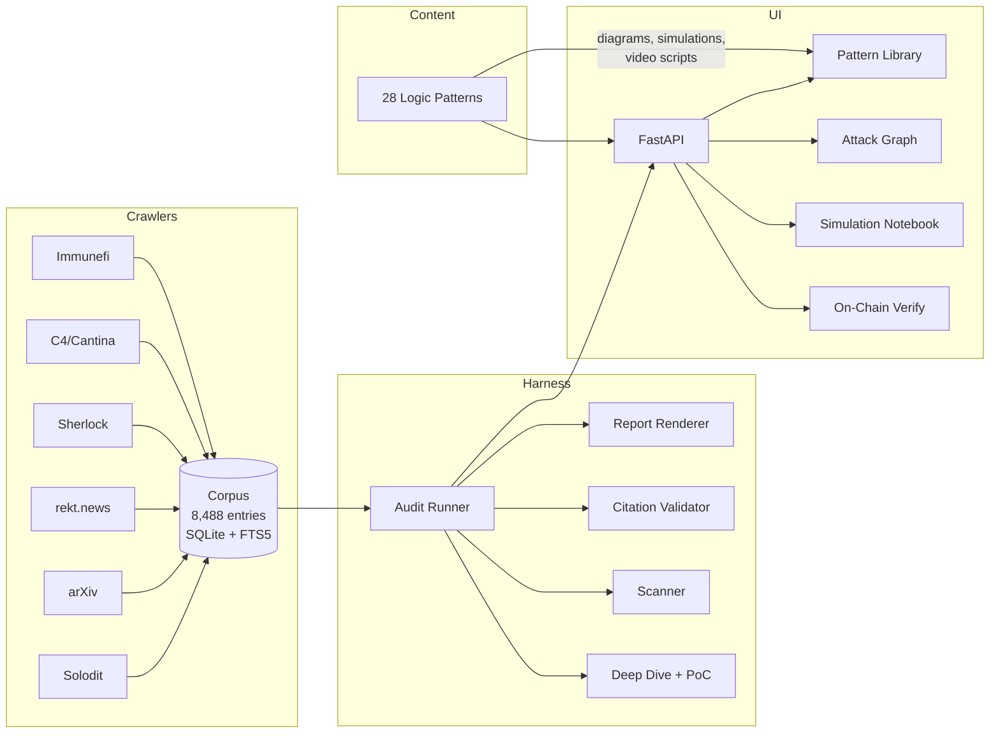

# Bricklane Web3 Bug Bounty Hunter

**AI-native bug bounty operations platform with a self-growing exploit corpus.**

[](https://github.com/ch-i/bricklane-web3-bug-bounty-hunter/actions/workflows/test.yml)
[](https://github.com/ch-i/bricklane-web3-bug-bounty-hunter/actions/workflows/lint.yml)
[](LICENSE)
[](https://python.org)
[](#corpus)

---

Bricklane automatically builds a security knowledge base from public vulnerability sources, then uses it to audit Solidity contracts with grounded, citation-backed findings. It ships with an interactive UI for exploring attack patterns, simulating exploits step-by-step, and verifying real-world incidents on-chain.

## Features

| Feature | Description |
|---|---|
| **Autoresearch Corpus** | Continuously ingests from 8 sources (Solodit, arXiv, rekt.news, Sherlock, Code4rena, Cantina, Immunefi, SWC Registry) into an 8,488-entry searchable knowledge base |
| **Grounded Auditing** | Audits Solidity contracts using two model families in parallel, with mandatory citation against corpus entries |
| **Pattern Scanner** | 15 built-in vulnerability signatures with confidence scoring and matched-line highlighting |
| **Attack Composition Graph** | Interactive force-directed graph showing how vulnerability patterns chain together in real exploits |
| **Simulation Notebook** | Step-by-step exploit trace with actors, state changes, Solidity snippets, and per-step transaction hashes |
| **On-Chain Verification** | Query live mainnet RPCs (Ethereum, BSC, Polygon, Arbitrum, Optimism) to prove incident tx hashes are real |
| **Synthesis Engine** | Generates cross-referenced logic pattern notes by composing findings from multiple corpus sources |
| **Recall Tracking** | Benchmark against historical exploits so detection improvements are measurable |

## Architecture



## Quickstart

```bash
# Clone and install
git clone https://github.com/ch-i/bricklane-web3-bug-bounty-hunter.git
cd bricklane-web3-bug-bounty-hunter
uv sync --extra ui --extra static

# Start the API + UI
uv run uvicorn api:app --host 0.0.0.0 --port 8000 &
cd ui && npm install && npm run dev
```

Open **http://localhost:5173** to explore the dashboard.

### CLI Tools

```bash
# Run an audit against a Solidity file
uv run bricklane audit path/to/Contract.sol

# Search the corpus
uv run bricklane search "flash loan reentrancy"

# Run the autoresearch loop
uv run bricklane autoresearch --batch 5

# Seed the SWC registry into corpus
uv run bricklane-seed-swc
```

## API Endpoints

| Endpoint | Method | Description |
|---|---|---|
| `/api/stats` | GET | Dashboard statistics |
| `/api/corpus/search` | GET | Full-text search across 8,488 entries |
| `/api/corpus/{id}` | GET | Single corpus entry with full body |
| `/api/library/patterns` | GET | List all 28 logic patterns |
| `/api/library/patterns/{slug}` | GET | Pattern detail + synthesis + related entries |
| `/api/content/{slug}` | GET | Enriched content (diagrams, video scripts, simulations) |
| `/api/scan` | POST | Scan Solidity source against 15 pattern signatures |
| `/api/graph/compositions` | GET | Attack composition graph (nodes + edges + incidents) |
| `/api/verify/tx/{chain}/{hash}` | GET | On-chain transaction verification via live RPCs |
| `/api/autoresearch/run` | POST | Trigger autoresearch batch |

## Content Patterns

28 indexed logic patterns spanning DeFi primitives, security, economics, infrastructure, governance, and MEV:

<details>
<summary>View all patterns</summary>

| Pattern | Domain | Incidents |
|---|---|---|
| Flash Loan Mechanics | DeFi | Euler ($197M), Cream ($130M) |
| Checks-Effects-Interactions | Security | The DAO ($60M), Rari ($80M) |
| Proxy Upgrade Patterns | Security | Nomad ($190M), Ronin ($624M) |
| Oracle Aggregation Staleness | DeFi | Mango Markets ($114M) |
| Access Control Hierarchies | Security | Poly Network ($611M) |
| Signature Replay (EIP-712) | Security | Wormhole ($320M) |
| Timelock Governance | Governance | Beanstalk ($182M) |
| Liquidation Mechanics | DeFi | Venus ($200M) |
| AMM Constant Product | DeFi | PancakeBunny ($45M) |
| ERC-4626 Vault Standard | DeFi | Common inflation pattern |
| Integer Overflow / Precision | Security | SWC-101 class |
| *+ 17 more patterns* | | |

</details>

Each pattern includes:
- **Synthesis note** — cross-referenced analysis from multiple corpus sources
- **Mermaid diagram** — visual attack flow
- **Video script** — explainer narrative
- **Simulation** — step-by-step exploit trace with real incident metadata and tx hashes

## Project Structure

```
bricklane-web3-bug-bounty-hunter/
├── harness/          # Core Python modules (11,830 LOC)
│   ├── audit_runner  # Multi-model parallel auditing with citation
│   ├── corpus        # SQLite + FTS5 corpus management
│   ├── scanner       # 15 vulnerability pattern signatures
│   ├── compositions  # Attack chain graph generation
│   ├── deep_dive     # Automated deep analysis + PoC generation
│   └── ...           # 31 modules total
├── crawlers/         # 8 source-specific ingestion scripts
├── corpus/           # 8,488 markdown entries with YAML frontmatter
├── content/          # 28 logic patterns (synthesis, diagrams, simulations)
├── contracts/        # Reference Solidity contracts
├── api.py            # FastAPI backend (~780 LOC)
├── ui/               # React + Vite frontend (11 components)
├── eval/             # Historical exploit benchmark + scoring
├── tests/            # 38 test files
├── mcp_server/       # MCP server for IDE integration
└── scripts/          # Utilities (seed, ingest, etc.)
```

## Development

```bash
# Install with all dev dependencies
uv sync --extra dev --extra ui --extra static

# Run tests
uv run pytest tests/ -v

# Lint
uv run ruff check .
uv run ruff format --check .
```

See [CONTRIBUTING.md](CONTRIBUTING.md) for detailed contribution guidelines.

## Security

This tool is for **defensive security research only**. See [SECURITY.md](SECURITY.md) for our responsible disclosure policy.

## License

[MIT](LICENSE) © Bricklane Contributors

---

*Powered by data from [Solodit](https://solodit.xyz), [arXiv](https://arxiv.org), [rekt.news](https://rekt.news), [Etherscan](https://etherscan.io), and the [SWC Registry](https://swcregistry.io).*
