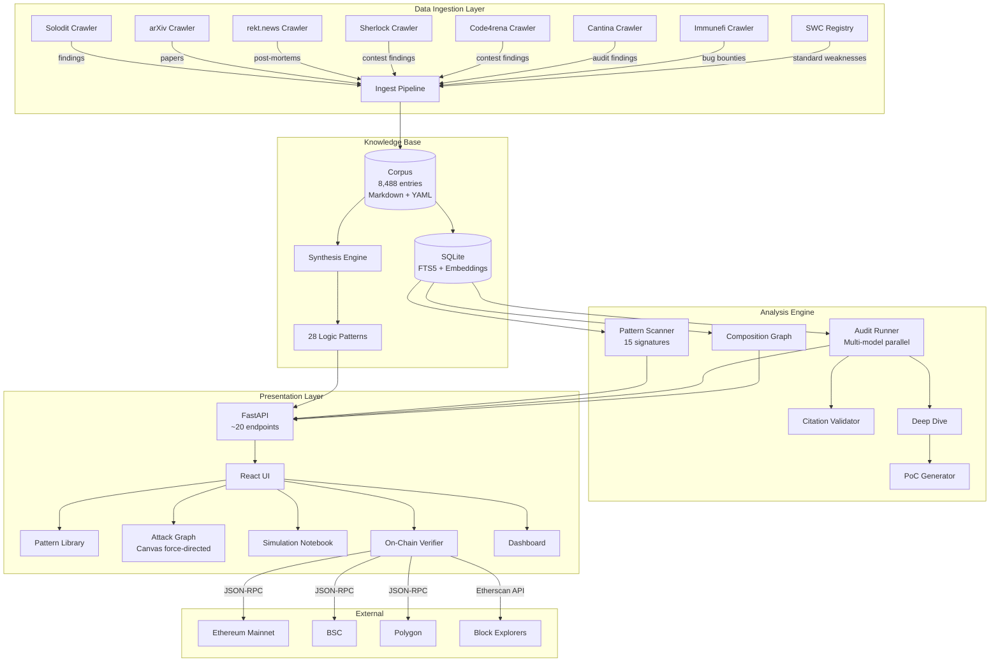
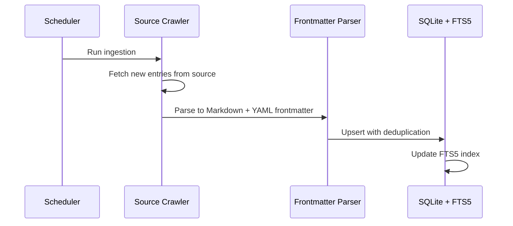
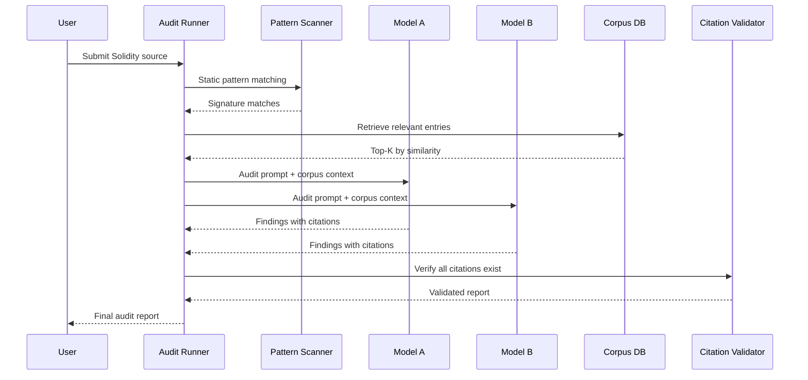

# Architecture

## System Overview

web3Sentinel is a security research platform that automatically builds a knowledge base from public vulnerability sources, then uses it to audit Solidity smart contracts with grounded, citation-backed findings.



## Data Flow

### 1. Ingestion

Each crawler in `crawlers/` implements a source-specific scraper:



Corpus entries follow a standard schema:

```yaml
---
id: solodit-12345
title: "Reentrancy in Withdrawal Function"
source: solodit
severity: High
vuln_class: [reentrancy]
protocol_category: [lending]
tags: [checks-effects-interactions]
---
# Finding body in Markdown
```

### 2. Synthesis

The synthesis engine (`harness/synthesize.py`) cross-references corpus entries to build logic patterns:

- Groups entries by `vuln_class` and `protocol_category`
- Identifies common attack primitives across incidents
- Generates structured notes with `derives_from` citations
- Produces diagrams, video scripts, and simulation JSON

### 3. Auditing



### 4. On-Chain Verification

The verification layer queries live blockchain nodes to prove incident data is real:

```
User clicks "Verify On-Chain"
  → API: GET /api/verify/tx/{chain}/{tx_hash}
    → Strategy 1: Etherscan API (full history, rate-limited)
    → Strategy 2: JSON-RPC fallback (recent blocks only)
  → Returns: block number, from/to, gas, status, event logs, contracts touched
```

## Key Modules

| Module | LOC | Purpose |
|---|---|---|
| `harness/audit_runner.py` | Core | Multi-model parallel audit orchestration |
| `harness/corpus.py` | Core | SQLite corpus with FTS5, embedding search |
| `harness/scanner.py` | Core | 15 vulnerability pattern signatures |
| `harness/compositions.py` | Core | Attack chain graph with incident mapping |
| `harness/deep_dive.py` | Analysis | Automated deep analysis of findings |
| `harness/poc.py` | Analysis | Proof-of-concept generation |
| `harness/citations.py` | Validation | Citation grounding verification |
| `harness/synthesize.py` | Synthesis | Cross-corpus pattern synthesis |
| `harness/autoresearch.py` | Automation | Research queue + batch processing |
| `api.py` | API | FastAPI with 20+ endpoints |

## Technology Stack

- **Backend**: Python 3.11+, FastAPI, SQLite + FTS5, Pydantic
- **Frontend**: React 19, Vite, Canvas API (force-directed graph)
- **Package Manager**: uv (Python), npm (JS)
- **Static Analysis**: Slither, Aderyn, Halmos, Mythril
- **CI**: GitHub Actions (pytest, ruff)
- **Data Format**: Markdown with YAML frontmatter
