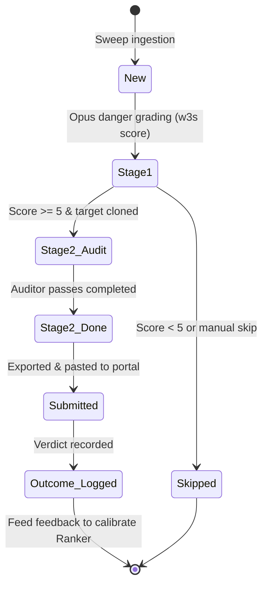

# Bounty Hunt Workflow

Bricklane unifies security analysis and contest execution, enabling security researchers to manage the end-to-end lifecycle of findings from initial target triage to finalized platform submission.

## Candidate Lifecycle

Each contract codebase or program under review is managed as a "Candidate" within `eval/candidates.jsonl`. Candidates transition through a series of structured states:



1. **New**: The target has been swept/discovered from a platform's active feed, but no analysis has run.
2. **Stage 1 (Ranked)**: The target is triaged by `harness/stage1.py`. Claude Opus assigns a danger rating (1-10) using file headers, lines of code, danger primitives (e.g. `delegatecall`, inline assembly, custom ERC20 integrations), and top corpus hits.
3. **Stage 2 (Audit)**: Active targets undergo static analysis, corpus matching, and parallel dual-model auditing.
4. **Stage 2 Done**: The reconciled findings list is written to `audits/<run>/findings.json`.
5. **Submitted**: Findings are exported into platform-specific templates and manually submitted to the portal.
6. **Outcome Logged**: Once judging completes, the outcome (e.g., accepted High/Medium, duplicate, rejected) is written to the submission log. This data is used to calibrate future Stage 1 triage rankings.

---

## Supported Platforms

Bricklane supports the ingestion feeds and custom submission styles of four major Web3 security platforms:

| Platform | Type | Target Scope | Output Template Format |
| :--- | :--- | :--- | :--- |
| **Code4rena** | Contests | Source-only repositories. Competitive auditing. | Severity prefix in title. Structured details, impact, and mitigation sections. |
| **Sherlock** | Contests | Source-only repositories. System-wide vulnerability focuses. | Detailed summary, vulnerability detail, impact, code snippets, and recommendation structure. |
| **Cantina** | Audits / Contests | Client codebases and source files. | Detailed finding descriptions with severity grading and exact LOC targets. |
| **Immunefi** | Bug Bounties | Live deployed contracts. Requires on-chain Proofs-of-Concept. | Emphasizes step-by-step reproduction instructions and structured Foundry script setup. |

---

## Submission Export Templates

Platform templates are defined in `harness/submissions.py`. When an audit completes, run the export command to generate files matching each platform's expected format:

```bash
# Export findings for Code4rena
uv run bricklane submit audits/20260713_0100_vuln_run --platform c4

# Export findings for Sherlock
uv run bricklane submit audits/20260713_0100_vuln_run --platform sherlock

# Export findings for Cantina
uv run bricklane submit audits/20260713_0100_vuln_run --platform cantina
```

### Feedback and Calibration Loop

Bounty outcomes are recorded in `submissions.jsonl` to close the loop:

```json
{
  "candidate_id": "c4-2026-07-lending",
  "finding_title": "Missing stale price check in Chainlink Oracle aggregator",
  "outcome": "accepted_medium",
  "duplicate_count": 3,
  "payout_usd": 1250.00,
  "ranker_score_prior": 8.5
}
```

By logging these outcomes, the triage heuristics (weights for danger primitives, size thresholds, and density of corpus similarities) are calibrated so that future triage runs prioritize high-yield contracts.
