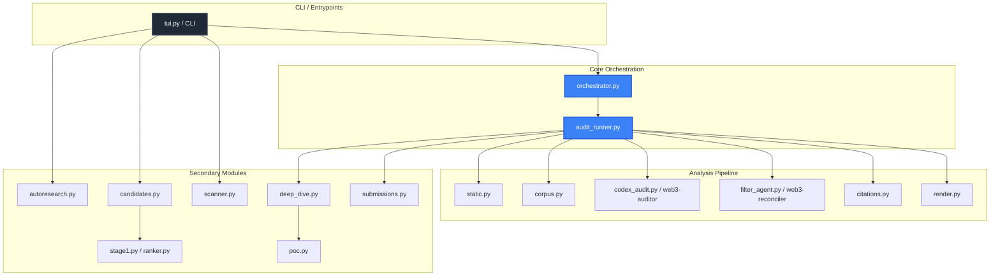
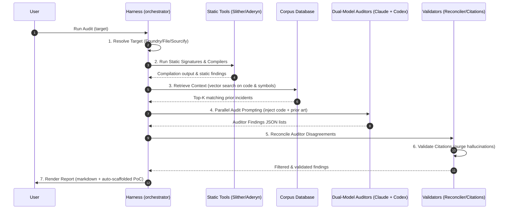

# Bricklane Audit Harness

The Bricklane harness is the core execution engine of the bug bounty platform. Composed of 31 Python modules (~12K lines of code), it coordinates static analysis tools, handles vector search across the exploit corpus, runs dual-model audits, reconciles differences, validates academic citations, generates Proofs-of-Concept, and prepares submissions.

## Module Map

Below is a breakdown of the primary modules within `harness/` and their roles:

| Module | Role |
| :--- | :--- |
| `orchestrator.py` | Top-level execution manager for the multi-model audit pipeline. |
| `audit_runner.py` | Manages directory prep, builds targets, invokes model adapters, and generates the final reports. |
| `scanner.py` + `signatures.py` | Runs 15 regex-based pattern detectors to identify low-hanging safety risks (e.g., delegatecall, assembly) with confidence scoring. |
| `corpus.py` | Database layer wrapping the SQLite FTS5 index and computing embeddings for similarity search. |
| `citations.py` | Verifies that all citations cited in audit reports are real, mapping to verified corpus IDs. Rejects hallucinated references. |
| `synthesize.py` | Gathers related clusters from the corpus to draft high-level logic pattern summaries. |
| `autoresearch.py` | Topic ingestion queue. Matches new research papers and findings to synthesize and link to patterns. |
| `candidates.py` | Queue management for active bounty programs and contest details. |
| `submissions.py` | Generates platform-specific markdown templates (C4, Sherlock, Cantina, Immunefi) and parses audit findings. |
| `ranker.py` + `stage1.py` | Triage and scoring layer using Claude Opus to rank target programs from 1 to 10 based on threat indicators. |
| `compositions.py` | Renders a force-directed attack chain graph mapping vulnerabilities to historical exploits. |
| `deep_dive.py` + `poc.py` | Runs deep, function-level scrutiny, maps state machine changes, and auto-scaffolds Foundry PoC files. |
| `static.py` | Wraps Slither, Aderyn, and Foundry compiler commands to fetch compiler artifacts. |
| `render.py` | Renders human-readable findings reports, highlights matched code lines, and formats output summaries. |

---

## Module Dependency Diagram



---

## Audit Stages

Every `bricklane audit` command executes a deterministic seven-stage security pipeline:



1. **Target Resolution**: Resolves file path, Foundry root directories, or `0x` contract addresses. Address resolutions query Sourcify or Etherscan to pull verified source files.
2. **Static Scans**: Runs Slither, Aderyn, and standard regex pattern scanners. Stores findings as preliminary context clues.
3. **Corpus Context Retrieval**: Performs semantic vector searches and FTS5 full-text queries matching the target's functions and imports against the ~8,488 historical exploit reports.
4. **Parallel Dual-Model Audit**: Invokes Claude (Opus) and GPT (Codex) in parallel. Both models receive the code, compiler flags, static analysis findings, and the top-K corpus matches to prevent hallucinations.
5. **Reconciliation**: A second-opinion agent (`filter_agent.py`) reconciles the findings, filtering duplicate titles and flagging major discrepancies for user review.
6. **Citation Validation**: Matches all reference IDs (e.g., `solodit-12345` or `swc-107`) against the database. If a finding contains hallucinated or missing references, it is auto-reclassified as `novel` or rejected.
7. **Report Generation**: Outputs a unified `report.md` along with a list of reproduction templates in `audits/<run>/poc/`.

---

## CLI Entry Points

Interact with the harness using the primary `bricklane` binary (or the `bl` shorthand, or the `w3s` alias during transition):

### 1. Audit Target
Run the full 7-stage pipeline against a Solidity file or Foundry folder:
```bash
# Single file audit
uv run bricklane audit contracts/VulnerableToken.sol

# Auditing a local Foundry project
uv run bricklane audit .

# Auditing an on-chain address
uv run bricklane audit 0xC02aaA39b223FE8D0A0e5C4F27eAD9083C756Cc2 --chain mainnet
```

### 2. Search Corpus
Search through the 8,488 exploit reports and vulnerability writeups via full-text search (FTS5):
```bash
uv run bricklane search "read-only reentrancy curve"
```

### 3. Autoresearch Loop
Fetch the latest papers and bounty findings, synthesize them into patterns, and expand the local database:
```bash
# Process 5 items in the research queue
uv run bricklane autoresearch --batch 5
```
